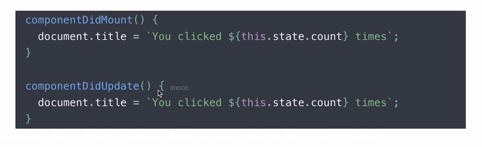
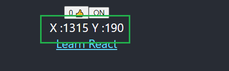
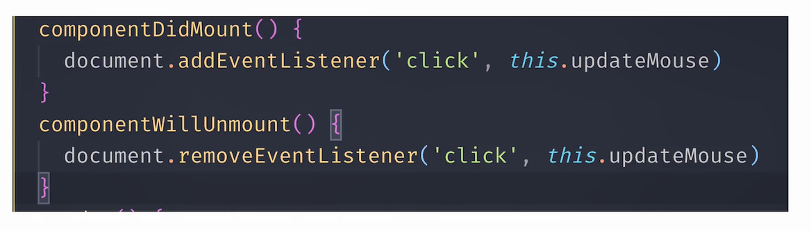
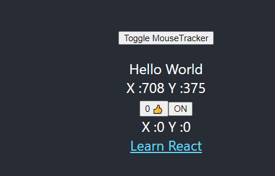
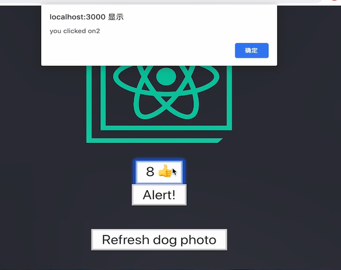
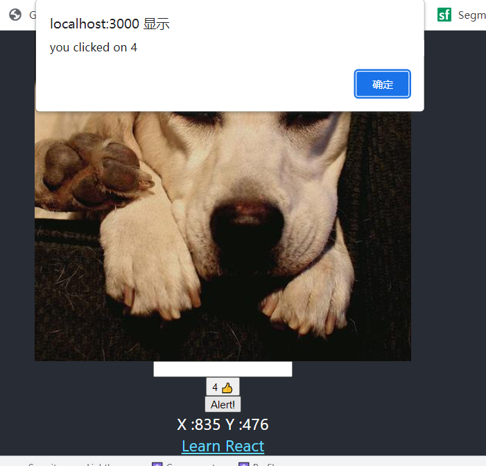
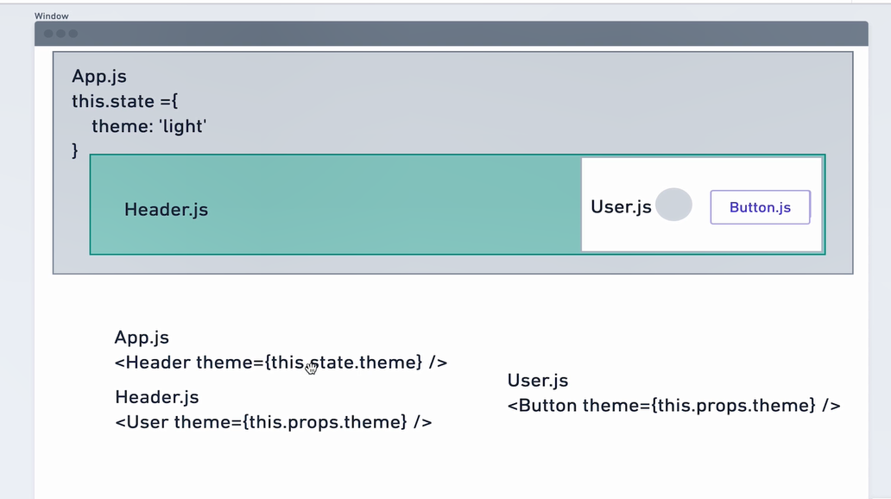

## ReactHook技巧

[TOC]

## 一 概念

1.什么是hook?

2.为什么要用hook?

-: 为函数组件提供状态管理能力,  扩展

-: 在Function组件中勾入更多React 特性, 以`use`开头


## 二 useState


`./components/LikeButton.tsx`

```js
// rafc  tsrafe
import React, { useState } from 'react'

const LikeButton: React.FC = () => {
    const [like, setLike] = useState(0)
    const [on, setOn] = useState(true)

    return (
        <div>
            <button onClick={() => setLike(like + 1)}>
                {like} 👍
            </button>
            <button onClick={() => setOn(!on)}>
                {on ? 'ON':'OFF' }
            </button>
        </div>
    )
}

export default LikeButton
```

改变函数内组件状态,在每次组件更新时候,  记住`状态值`

## 三 useEffect

`纯函数`:输入确定,   输出确定,无`副作用`

`副作用`:网络请求,手动dom操作,订阅数据来源, ... 与纯函数界面渲染不同


两种场景:

- 1. 无需清除副作用(**Effect**)
- 2. 需要清除的副作用


### 3.1 无需清除副作用(**Effect**)

实现: `使用useEffect 修改DOM 完成标题更新`

`class实现:`



`hooks实现:`

```js
// rafc  tsrafe
import React, { useEffect, useState } from 'react'

const LikeButton: React.FC = () => {
    const [like, setLike] = useState(0)
 ...
    useEffect(()=>{//渲染和更新时候执行.
        document.title = `点击了 ${like} 次`
    })

    return (
        <div>
            <button onClick={() => setLike(like + 1)}>
                {like} 👍
            </button>
          ...
        </div>
    )
}

export default LikeButton
```


### 3.2 需要清除副作用(**Effect**)

> dom操作需要清除监听, 防止内存泄漏,卡顿页面

实现: `使用useEffect 完成鼠标跟踪器(鼠标移动时候显示鼠标位置)`

原理:挂载document上, 点击click,修改state,当前值



`class实现:`



`hooks实现:`// 无依赖时候,  会多次重复调用effect 注册,执行

```js
import React, { useEffect, useState } from 'react'

const MouseTracker: React.FC = () => {
    const [position, setPosition] = useState({ x: 0, y: 0 })

    useEffect(() => {
        console.log('add effect',position.x);

        const updateMouse = (e: MouseEvent) => {
            console.log('inner');
            setPosition({
                x: e.clientX,
                y: e.clientY
            })
        }

        document.addEventListener('click', updateMouse)
        return () => {
            console.log('remove effect',position.x);

            document.removeEventListener('click', updateMouse)

        }
    })

    console.log('before render',position.x);
    return (
        <div>
            X :{position.x} {` `} Y :{position.y}
        </div>
    )
}

export default MouseTracker
```


\*: `忘记react声明周期,重新接触react effect,发现每次渲染都会调用effect(有些浪费), 思考如何规避多次调用`------>`控制effect调用次数`

### 3.3 控制(**Effect**)调用次数

> 避免每次渲染都会调用,控制次数

实现:控制useEffect的执行

修改前面例子代码 ,利用`deps`,依赖


```js

function App() {
  const [show, setShow] = useState(true)
  return (
    <div className="App">
      <header className="App-header">
       ...
        <p>
          <button onClick={()=>setShow(!show)}>Toggle MouseTracker</button>
        </p>
        <LikeButton />
        {show&&<MouseTracker />}
      ...
      </header>
    </div>
  );
}

export default App;
```

`./components/MouseTracker.tsx`

> 添加依赖项 [],   挂载,   卸载时候执行callback/   `避免一更新就执行回调`

```js
import React, { useEffect, useState } from 'react'

const MouseTracker: React.FC = () => {
    const [position, setPosition] = useState({ x: 0, y: 0 })

    useEffect(() => {
      ...
        document.addEventListener('click', updateMouse)
        return () => {
            ...

        }
    },[])

    console.log('before render',position.x);
    return (
       ...
    )
}

export default MouseTracker
```

`./components/LikeButton.tsx`

> 添加`[like]` 依赖,   只在依赖项, `like`发生变化时候执行callback

```js
// rafc  tsrafe
import React, { useEffect, useState } from 'react'

const LikeButton: React.FC = () => {
    const [like, setLike] = useState(0)
  ...

    useEffect(()=>{
              console.log('click')
              document.title = `点击了 ${like} 次`
    },[like])

    return (
        <div>
            <button onClick={() => setLike(like + 1)}>
                {like} 👍
            </button>
        </div>
    )
}

export default LikeButton
```

## 四 自定义hook

- 将组件逻辑提取到可重用函数

`之前方式:`hoc / render props

实现: 使用`自定义hook` 抽象鼠标跟踪器


注:

1. 必须use 开头,否则识别不上
2. 每次使用hook ,会在函数内部形成独立的调用空间, 不会共用


`编写hooks`

`\hooks\useMousePosition.tsx`

```js
import React, { useEffect, useState } from 'react'

const useMousePosition= () => {
    const [position, setPosition] = useState({ x: 0, y: 0 })

    useEffect(() => {
        const updateMouse = (e: MouseEvent) => {
            setPosition({
                x: e.clientX,
                y: e.clientY
            })
        }

        document.addEventListener('mousemove', updateMouse)
        return () => {
            document.removeEventListener('mousemove', updateMouse)
        }
    },[])

    return position
}

export default useMousePosition
```

`调用hooks` , 并复用

在需要的地方`引入`

```js
import React, { useState } from 'react';
...
import useMousePosition from './hooks/useMousePosition';


function App() {
  const [show, setShow] = useState(true)

+ const position = useMousePosition()

  return (
    <div className="App">
      <header className="App-header">
        
+      X :{position.x} {` `} Y :{position.y}
...
      </header>
    </div>
  );
}

export default App;
```



### 4.1 hoc

> 发送请求  (展示Loading, 请求结束隐藏Loading),   实现逻辑复用

hoc: `高阶组件`

`高阶组件`: 是一个函数,接受一个组件作为参数,    返回一个新组件

`入参`: 组件------>`返回`:新组件


`实现`:点击按钮,发送请求,  拿到结果后--->展示图片

`/hocs/withLoader.tsx`

```js
// high order component
import React from 'react'
import axios from 'axios'

interface ILoaderState {
  data: any,
  isLoading: boolean
}
interface ILoaderProps {
  data: any,
}
const withLoader = <P extends ILoaderState>(WrappedComponent: React.ComponentType<P>, url: string) => {
  return class LoaderComponent extends React.Component<Partial<ILoaderProps>, ILoaderState> {
    constructor(props: any) {
      super(props)
      this.state = {
        data: null,
        isLoading: false
      }
    }
    componentDidMount() {
      this.setState({
        isLoading: true,
      })
      axios.get(url).then(result => {
        this.setState({
          data: result.data,
          isLoading: false
        })
      })
    }
    render() {
      const { data, isLoading } = this.state
      return (
        <>
          { (isLoading || !data) ? <p>data is loading</p> :
            <WrappedComponent {...this.props as P} data={data} />
          }
        </>
      )
    }
  }
}

export default withLoader
```


`引入`

`App.tsx`

```js
import React, { useState } from 'react';
...
import withLoader from './hocs/withLoader';

import './App.css';

interface IShowResult {
  message:string,
  status:string,
}

const DogShow:React.RC<{data:IShowResult}>=({data})=>{
  return (
    <>
      <h2>Dog show:{data.status}</h2>
      
    </>
  )
}

function App() {
 
  const WrappedDogShow = withLoader(DogShow, 'https://dog.ceo/api/breeds/image/random')

  return (
    <div className="App">
      <header className="App-header">
        
       ...

        <WrappedDogShow />
       ...
      </header>
    </div>
  );
}

export default App;

```


`弊端`:添加额外空节点,  逻辑 看着复杂  


### 4.2 自定义Hook 

> 完成相同逻辑

`作用`:重复代码封装为一个函数, 像调用一个函数一样调用Hook

`/hooks/useURLLoader.tsx`

```js
import { useEffect, useState } from 'react'
import axios from 'axios'
/**
 * url: 接口url
 * deps: 依赖项,传入数组, 依赖变化时候更新数据
 */
const useURLLoader = (url: string, deps: any[] = []) => {
  const [data, setData] = useState<any>(null)
  const [loading, setLoading] = useState(false)
  useEffect(() => {
    setLoading(true)
    axios.get(url).then(result => {
      setData(result.data)
      setLoading(false)
    })
  }, deps)
  return [data, loading]
}

export default useURLLoader
```

`引入`

`App.tsx`

```js
import React, { useState } from 'react';
import useURLLoader from './hooks/useURLLoader';

interface IShowResult {
  message:string,
  status:string,
}


function App() {
  const [show, setShow] = useState(true)

  const [data, loading] = useURLLoader('https://dog.ceo/api/breeds/image/random', [show])

  const dataResult = data as IShowResult // 断言 data 的类型 为  IShowResult

  return (
    <div className="App">
      <header className="App-header">
        
        <p>
          <button onClick={()=>setShow(!show)}>Toggle dog Image</button>
        </p>
       

        {
          loading?'🎁...':
        }
        
      </header>
    </div>
  );
}

export default App;

```

`通用封装`  `useAxios.tsx`

```js
import { useEffect, useState } from 'react'
import axios from 'axios'

const useAxios = (config = {}) => {
    // 1. 定义
    const [data, setData] = useState<any>(null)
    const [loading, setLoading] = useState(false)
    const [error, setError] = useState<any>(null)
    useEffect(() => {
        setLoading(true)
        // 2. 设置, 发送请求
        axios(config)
            .then(result => {
                setData(result.data)
            })
            .catch(err => {
                setError(err)
            })
            .finally(() => {
                setLoading(false)
            })
    }, [config])// deps : 中避免出现引用类型, 会出现死循环问题

    // 返回
    return [data, loading, error]
}

export default useAxios
```

## 五 useRef

>在任意次渲染中, props 与state保持不变,每次渲染都是相互独立

`用法:`

1.缓存数据,保存变量

2.模拟生命周期, didMount

3.获取dom

`解决`: 定时事件点击后相互独立,缓存数据




```js
import React, { useState, useEffect, useRef, useContext } from 'react'

const LikeButton: React.FC = () => {
  const [like, setLike] = useState(0)
  const likeRef = useRef(0)
  const didMountRef = useRef(false)
  const domRef = useRef<HTMLInputElement>(null)

// 2. 模拟生命周期    
  useEffect(() => {
    if (didMountRef.current) {
      console.log('this is updated')
    } else {
      didMountRef.current = true
    }
  })
//3.获取dom
  useEffect(() => {
    if (domRef && domRef.current) {
      domRef.current.focus()
    }
  })
// 1. 缓存数据,使用同样一份数据进行同步
  function handleAlertClick() {
    setTimeout(() => {
      alert('you clicked on ' + likeRef.current)
    }, 3000)
  }
  return (
    <>
    <input type="text" ref={domRef} />
    <button onClick={() => {setLike(like + 1); likeRef.current++}}>
        {/*优化为    <button onClick={() => {setLike( ++likeRef.current);}}>*/}
      {like} 👍
    </button>
    <button onClick={handleAlertClick}> Alert! </button>
    </>
  )
}
export default LikeButton
```




## 六 useContext



> 避免层层传递

1. `context/types.ts`定义types.ts

```ts
export interface IThemeProps {
    [key:string]: {color:string; background:string}
}
```


2.`context/theme.ts`(可以抽象为HOOK)

```ts
import React from 'react'
import { IThemeProps } from './types'

// 定义传递的主题
export const themes: IThemeProps = {
    'light': {
        color: '#000',
        background: '#eee',
    },
    'dark': {
        color: '#fff',
        background: '#222',
    },
    'green':{
        color: '#fff',
        background: '#0f0',
    },
}

export const ThemeContext = React.createContext(themes.light)

```

3.`App.tsx`引用

```js
import React, { useState } from 'react';
+ import HelloTheme from './components/HelloTheme';
+ import { ThemeContext, themes } from './context/theme'

function App() {
  const dataResult = data as IShowResult // 断言 data 的类型 为  IShowResult
  return (
    <div className="App">
      <ThemeContext.Provider value={themes.green}>
        <header className="App-header">
          <HelloTheme/>
...
        </header>
      </ThemeContext.Provider>

    </div>
  );
}

export default App;

```


4.`/components/HelloTheme.tsx`调用

`HelloTheme.tsx`

```js
import React, { useContext } from "react";
+ import { ThemeContext } from '../context/theme'

interface IHelloProps {
    message?: string
}

const HelloTheme: React.FC<IHelloProps> = (props) => {
+   const theme = useContext(ThemeContext)
+    const style = {
        background: theme.background,
        color: theme.color
    }
    return (
        <div style={style}>
            {props.message}
        </div>
    )
}

HelloTheme.defaultProps = {
    message: "Hello World"
}

export default HelloTheme
```


## 总结---HOOKS规则

- 1. 只在最顶层使用Hook
- 2. 只在React 函数中调用Hook


## 其他HOOKS

[Hook API 索引 – React (docschina.org)](https://react.docschina.org/docs/hooks-reference.html)


`useReducer`

`useCallback`: 记住某些函数进行优化


https://usehooks.com/


